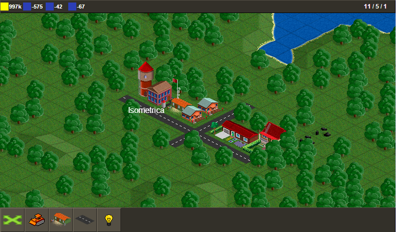

# The project is broken and dead. Sorry.
To run it do npm install, cd to root, run webpack, then host /app dir and open index.html in browser;

# Free to play city building game

### About
This is a JavaScript based city building game with retro graphics. 
The goal is to make a tribute game to all of the old-school classical city building games, strategy games and tycoons with single codebase for multiple platforms.

### Roadmap
Currently the project is in development, game has minimal functionality at the moment, but not enough to call it "the game".
Below are listed development milestones/guidelines, that may vary by time.

###Alpha1

* Standart city building experience. Building buildings, place roads
* Resource gathering and usage
* Building set of at least 20 different building
* Building rotation
* Vehicles and other signs of life in city
* Save\load game functionality
* Primitive research system
* Building import system
* Primite cross-platform UI

###Alpha2

* One handed UI for mobile platforms
* Proper UI for desktops
* Resources bank
* Simple homepage
* Clever cars, going from garage to parking lot etc.
* Bridges
* More buildings
* Camera rotation
* Code minification, resources optimization - done
* build task

### Dependencies
* homegrow 2.5D engine
* jquery, for UI
* backbone & underscore
* backbone-marionette
* require js with text plugin
